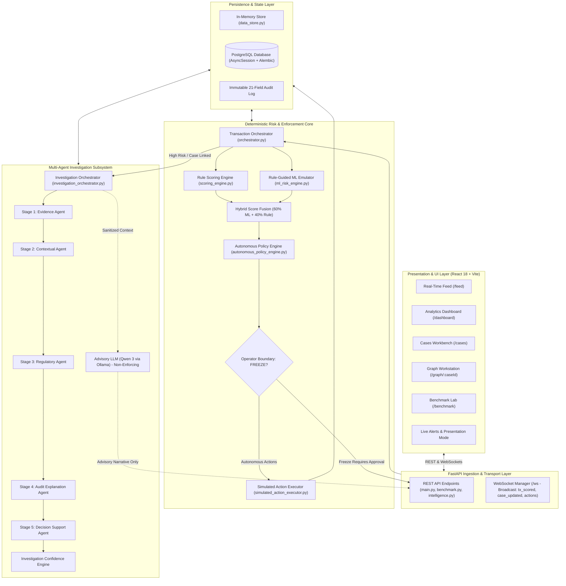

# SENTINEL — Real-Time Financial Crime Detection & Autonomous Investigation Platform

**SENTINEL** is an enterprise-grade, real-time financial crime detection, dynamic case management, multi-agent investigation, and compliance benchmarking platform. Built for Financial Intelligence Units (FIUs), AML compliance teams, and fraud analysts, SENTINEL ingests high-velocity transaction streams, executes deterministic hybrid risk scoring (60% ML + 40% Rules), constructs interactive multi-hop financial network graphs, orchestrates an asynchronous 5-stage automated investigation pipeline, and enforces strict, non-negotiable governance boundaries between automated execution and human operator authorization.

---

## 📋 Table of Contents

1. [Project Overview](#-project-overview)
2. [Current System Status & Operating Reality](#-current-system-status--operating-reality)
3. [System Architecture](#-system-architecture)
4. [End-to-End Transaction Flow](#-end-to-end-transaction-flow)
5. [Risk Scoring Engine & Hybrid Fusion](#-risk-scoring-engine--hybrid-fusion)
6. [Autonomous Policy Engine & Human Approval Boundary](#-autonomous-policy-engine--human-approval-boundary)
7. [5-Stage Multi-Agent Investigation Pipeline](#-5-stage-multi-agent-investigation-pipeline)
8. [Investigation Confidence Index](#-investigation-confidence-index)
9. [Advisory LLM Intelligence (Qwen / Ollama)](#-advisory-llm-intelligence-qwen--ollama)
10. [Multi-Hop Graph & Network Intelligence](#-multi-hop-graph--network-intelligence)
11. [Asset Recovery Engine](#-asset-recovery-engine)
12. [Benchmark Lab & Synthetic Testing Bench](#-benchmark-lab--synthetic-testing-bench)
13. [Analytics & Telemetry Dashboard](#-analytics--telemetry-dashboard)
14. [Real-Time WebSocket Architecture & Presentation Mode](#-real-time-websocket-architecture--presentation-mode)
15. [Frontend Application & Navigation](#-frontend-application--navigation)
16. [Authentication & Role Simulation](#-authentication--role-simulation)
17. [Database Architecture & Persistence Models](#-database-architecture--persistence-models)
18. [Technology Stack](#-technology-stack)
19. [Repository Structure](#-repository-structure)
20. [Local Installation & Setup](#-local-installation--setup)
21. [Running the Application](#-running-the-application)
22. [API Reference](#-api-reference)
23. [WebSocket Event Reference](#-websocket-event-reference)
24. [Testing & Quality Assurance](#-testing--quality-assurance)
25. [Current Limitations & Extension Areas](#-current-limitations--extension-areas)

---

## 🎯 Project Overview

SENTINEL bridges the critical divide between high-speed automated fraud detection and deep forensic investigations. Modern financial crime operates across multi-hop layered mule networks at sub-second velocity. Traditional anti-money laundering (AML) platforms either overload analysts with disconnected alerts or risk regulatory disaster through uncontrolled automated account lockouts.

SENTINEL solves this through three core principles:
1. **Deterministic Hybrid Risk Scoring**: Predictable, reproducible risk calculation fusing rule-based heuristics with a correlated rule-guided ML emulator ($0.60 \times \text{ML} + 0.40 \times \text{Rule}$).
2. **Strict Human-in-the-Loop Governance Boundary**: Routine containment actions (monitoring, analyst queue escalation) execute autonomously when Automate Mode is active, but **Account Freezes NEVER execute autonomously**. They strictly require authorized human operator sign-off (`REQUIRES_OPERATOR_ACTION`).
3. **Decoupled Advisory AI**: Advisory Large Language Models (Qwen 3 via local Ollama) synthesize human-readable investigative narratives from verified agent findings, but have **zero** authority to alter risk scores, mutate database state, or trigger enforcement actions.

---

## 🚦 Current System Status & Operating Reality

To ensure total transparency for technical evaluators, judges, and developers joining the codebase, the following outlines the **actual working implementation** today:

| Subsystem | Actual Current Implementation Status | Operating Nature |
| :--- | :--- | :--- |
| **Risk Scoring** | **Active & Live** | 4-factor rule engine + dynamic boost factors + proportional amount scaler. |
| **ML Engine** | **Rule-Guided ML Emulator** | Correlated statistical emulator tracking rule score ($r > 0.95$). Supports deterministic seed for 100% reproducible testing. **Not a trained binary model file**. |
| **Hybrid Score** | **Active & Live** | Deterministic fusion: $\text{floor}(0.60 \times \text{ML} + 0.40 \times \text{Rule})$. Clamped in $[0, 100]$. |
| **Policy Engine** | **Active & Live** | Deterministic policy evaluation with fail-closed safety rules and `Automate Mode` toggle. |
| **Human Freeze Boundary** | **Active & Live** | Hard governance boundary: `FREEZE` actions return `REQUIRES_OPERATOR_ACTION`. Zero autonomous freezes. |
| **Investigation Pipeline** | **Active & Live** | 5 asynchronous Python stages (Evidence, Contextual, Regulatory, Audit, Decision Support). |
| **Investigation Confidence** | **Active & Live** | Deterministic formula: $0.35 \times \text{Completeness} + 0.40 \times \text{Agreement} + 0.25 \times \text{Diversity} - \text{Contradictions}$. |
| **Qwen / Ollama** | **Active (Advisory Only)** | Local `qwen3:8b` via Ollama HTTP API. Returns structured JSON summaries. Fails gracefully if offline. |
| **Graph Module** | **Active & Live** | NetworkX backend + Cytoscape.js frontend. Identifies 6 authentic topologies and lead suspects. |
| **Asset Recovery** | **Active & Live** | Calculates non-withdrawn account balances capped at total fraud exposure. |
| **Benchmark Lab** | **Active & Live** | Minimal setup, 7 test scenarios, 7-step guided transaction builder, deterministic repeat test ($\Delta = 0$). |
| **Analytics Dashboard** | **Active & Live** | 6-tier telemetry story strictly derived from authentic backend state (no fabricated numbers). |
| **Presentation Mode** | **Active & Live** | Global client-side toggle that suppresses intrusive alert toasts during demonstrations without altering event streams. |
| **Database** | **Active & Live** | Dual support: In-Memory store (`data_store.py`) for zero-setup dev, PostgreSQL + AsyncSession for production. |
| **Authentication** | **Simulated / Client-Side** | Persona toggle (`admin` / `operator`) stored in `localStorage`. Client-side only; not backend JWT/OAuth2. |
| **External Banking APIs** | **Simulated Sandbox** | Bank, telecom, and police integrations simulated via local state changes (`mock_apis.py`). |

---

## 🏗️ System Architecture



---

## 🔄 End-to-End Transaction Flow

1. **Ingestion**: Transaction is received via `POST /transaction`, simulated by `simulator.py`, or triggered inside the `Benchmark Lab`.
2. **Validation & State Initialization**: The payload is validated; sender and receiver accounts are initialized in the storage layer.
3. **Rule-Based Scoring**: `scoring_engine.py` evaluates 4 core rule weights (New Receiver, Amount Deviation, Time Anomaly, Active Call) plus dynamic telemetry boosts.
4. **Proportional Amount Scaling**: Transactions below ₹5,000 are proportionally scaled down to prevent minor routine payments from generating false positive high-risk alerts.
5. **Rule-Guided ML Emulator**: `predict_ml_score()` generates a correlated score tracking the rule score with band-proportional noise.
6. **Hybrid Score Fusion**: Final score is calculated deterministically:
   $$\text{Final Score} = \text{floor}(0.60 \times \text{ML} + 0.40 \times \text{Rule})$$
7. **Risk Tier Assignment**:
   - **`CRITICAL`**: $\ge 85$
   - **`HIGH`**: $70 - 84$
   - **`MEDIUM`**: $40 - 69$
   - **`LOW`**: $< 40$
8. **Case Linking & Graph Building**: High-risk transactions ($\ge 70$) are linked to an active case or trigger new case creation. `graph_engine.py` maps the transaction edge and topological layer.
9. **Autonomous Policy Evaluation**: `evaluate_autonomous_policy()` checks risk thresholds, case state, and the `Automate Mode` toggle:
   - If action is `FREEZE`, policy returns `decision: "EXECUTE"`, `execution_status: "REQUIRES_OPERATOR_ACTION"`.
   - If `Automate Mode` is OFF, non-freeze actions default to `DO_NOT_EXECUTE` (`POL-MODE-OFF`).
   - If `Automate Mode` is ON, routine actions (`MONITOR`, `ENHANCED_MONITORING`, `ESCALATE_ANALYST_REVIEW`) execute autonomously.
10. **Action Execution & Audit Logging**: `execute_simulated_action()` transitions account states (`ACTIVE`, `FROZEN`, `MONITORING`, `ACTIONED`) and records an immutable 21-field audit entry.
11. **Multi-Agent Investigation**: If linked to a high-risk case, `investigation_orchestrator` asynchronously executes all 5 analytical stages and computes the Investigation Confidence index.
12. **Real-Time Sync**: `ConnectionManager` broadcasts events (`tx_scored`, `case_updated`, `transaction.action`) to all connected WebSockets.
13. **Analyst Review**: Compliance analysts view the transaction in the Real-Time Feed or Cases Workbench, inspect Cytoscape graphs, and submit stateful dispositions (`POST /cases/{case_id}/disposition`).

---

## ⚖️ Risk Scoring Engine & Hybrid Fusion

SENTINEL employs a deterministic scoring pipeline combining human-auditable rules with statistical machine learning emulation.

### Core Rule Weights (`app/core/config.py`)

| Feature | Weight | Value | Description |
| :--- | :--- | :--- | :--- |
| **New Receiver** | **35%** | 0 or 100 | First transfer from sender to this beneficiary account |
| **Amount Deviation** | **30%** | 0 – 100 | Ratio of transaction amount to typical monthly baseline ($2\times \text{baseline} = 100$) |
| **Time Anomaly** | **20%** | 0 or 100 | Off-hours payment initiated late at night (10:00 PM – 6:00 AM) |
| **Active Call Flag** | **15%** | 0 or 100 | Device indicates customer was on an active phone call during payment (coercion indicator) |

### Dynamic Boost Telemetry

When advanced threat indicators are detected, mandatory score boosts are incorporated:
- **Velocity Spike**: `velocity_flag` (+40 contribution)
- **Cross-Border Corridor**: `is_cross_border` (+50 contribution)
- **Device / Location Anomaly**: `device_changed` / `location_changed` (+40 contribution)
- **Crypto Transfer**: `is_crypto_related` (+50 contribution)
- **Remote Access Tool**: `is_remote_access_active` (+50 contribution)
- **Scripted Automation**: `is_scripted` (+40 contribution)
- **Rapid Bulk Transfer**: `bulk_transfer_flag` (+30 contribution)
- **First-Time Payee Added**: `new_payee_added` (+30 contribution)

### Multi-Hop Decay Formula
In money movement chains, subsequent intermediary hops inherit and decay the origin risk score:
$$\text{Hop Score} = \text{int}\left(\text{Origin Score} \times \left(0.85^{\max(0, \text{hop} - 1)}\right)\right)$$

### Proportional Amount Scaler
For small transactions below ₹5,000 with no critical flags, the risk score is scaled to reduce retail false positives:
$$\text{Scaling Factor} = 0.30 + \left(0.70 \times \frac{\text{Amount}}{5000}\right)$$
If critical coercion flags are present, an absolute floor of 25 is maintained.

### Rule-Guided ML Emulator (`app/services/ml_risk_engine.py`)

SENTINEL implements a **Rule-Guided ML Emulator** rather than a traditional serialized model at runtime:
- **Offline Artifact Context**: An offline scikit-learn model file `fraud_model.pkl` (`backend/backend/models/fraud_model.pkl`, trained via `backend/scripts/train_model.py`) exists in the repository from earlier development iterations.
- **Runtime Reality**: The active runtime backend (`app/services/ml_risk_engine.py`) **does NOT load or use `fraud_model.pkl`** (and intentionally imports neither `pickle` nor `joblib`). Instead, it executes the live **Rule-Guided ML Emulator**.
- **Design Justification**: This architecture guarantees high correlation ($r > 0.95$) with explainable rules, eliminates fragile Python pickle deserialization issues across environments, and supports deterministic pseudo-random seeds for 100% reproducible testing.
- **Risk Bands & Noise Bounds**:
  - High Risk ($\ge 80$): Rule score $\pm 5$ noise (tight certainty band)
  - Medium Risk ($\ge 50$): Rule score $\pm 10$ noise (moderate uncertainty)
  - Low Risk ($< 50$): Rule score $\pm 15$ noise (exploratory zone)
- **Deterministic Seed**: When a seed is passed (e.g. during Benchmark Lab evaluations or regression tests), a deterministic generator (`random.Random(seed)`) is used, guaranteeing that repeated evaluation of identical inputs yields **identical scores ($\Delta = 0$)**.

---

## 🛡️ Autonomous Policy Engine & Human Approval Boundary

The Autonomous Policy Engine (`app/engines/autonomous_policy_engine.py`) enforces strict compliance guardrails:

### Fail-Closed Design
Evaluations immediately return `decision: "REJECT"` if:
- Transaction payload is missing or corrupted (`POL-ERR-NO-TX`).
- Risk score is missing, invalid, or negative (`POL-ERR-NO-SCORE`).
- Case status is closed (`CLOSED_CONFIRMED_FRAUD`, `CLOSED_FALSE_POSITIVE`).

### Automate Mode Toggle
- **Automate Mode OFF**: Routine actions default to `decision: "DO_NOT_EXECUTE"`, `policy_rule_id: "POL-MODE-OFF"`.
- **Automate Mode ON**: Autonomous execution authorized for `MONITOR`, `ENHANCED_MONITORING`, `ESCALATE_ANALYST_REVIEW`, `BLOCK`, `FILE_STR`, `CLOSE_ACCOUNT`.

### The Non-Negotiable Freeze Boundary
> [!IMPORTANT]
> **Zero Autonomous Freezes**:
> Under institutional safety rules, **`FREEZE` actions NEVER execute autonomously**.
> Even when Automate Mode is ON and a transaction has a CRITICAL risk score ($\ge 85$), the policy engine returns:
> `execution_status: "REQUIRES_OPERATOR_ACTION"`
> 
> Account freezes strictly require an authorized compliance operator to click **Freeze** in the UI or call `POST /action/freeze`. Zero live banking accounts are altered without human sign-off.

---

## 🔍 5-Stage Multi-Agent Investigation Pipeline

When a case is opened, `investigation_orchestrator.py` asynchronously executes 5 dependency-ordered analytical stages:

```mermaid
flowchart LR
    Start([Case Created]) --> STG1[1. EVIDENCE<br/>evidence_agent.py]
    STG1 --> STG2[2. CONTEXTUAL<br/>contextual_agent.py]
    STG2 --> STG3[3. REGULATORY<br/>regulatory_agent.py]
    STG3 --> STG4[4. AUDIT EXPLANATION<br/>audit_explanation_agent.py]
    STG4 --> STG5[5. DECISION SUPPORT<br/>analyst_agent.py]
    STG5 --> Conf[Compute Investigation Confidence]
    Conf --> Persist[(Durable Run Commit)]
    Persist --> WS[Broadcast: investigation.completed]
```



1. **Stage 1: Evidence Collection (`evidence_agent.py`)**:
   - Gathers empirical data across 5 core dimensions: Transaction Core, Origin Baseline, Counterparty Flow, Network Graph, and Financial Exposure.
2. **Stage 2: Contextual Investigation (`contextual_agent.py`)**:
   - Detects behavioral patterns: rapid layered mule cascades, sudden velocity spikes, rapid drain, and account off-boarding.
3. **Stage 3: Regulatory Risk Assessment (`regulatory_agent.py`)**:
   - Evaluates compliance indicators under PMLA guidelines, heuristic risk indices, and Suspicious Transaction Report (STR) filing triggers.
4. **Stage 4: Audit Explanation (`audit_explanation_agent.py`)**:
   - Generates step-by-step forensic reasoning narratives, key findings, and explicit data gap disclosures.
5. **Stage 5: Analyst Decision Support (`analyst_agent.py`)**:
   - Synthesizes findings into human analyst recommendations and disposition priority ratings (`CRITICAL`, `HIGH`, `MEDIUM`, `LOW`).

---

## 📈 Investigation Confidence Index

The Investigation Confidence Index measures **evidence support strength and analytical consensus**, NOT raw fraud probability.

$$\text{Confidence Score} = \text{clamp}\left(\text{round}\left(0.35 \cdot C + 0.40 \cdot A + 0.25 \cdot D - 1.0 \cdot K, 1\right), 0.0, 100.0\right)$$

- **$C$ (Evidence Completeness, 35%)**: Coverage across the 5 core empirical evidence categories.
- **$A$ (Agent Agreement, 40%)**: Severity consensus across evaluating agents (Contextual, Regulatory, Decision Support).
- **$D$ (Source Diversity, 25%)**: Ratio of distinct evidence sources utilized.
- **$K$ (Contradiction Penalty)**: Penalty subtracted for conflicting agent severity ratings (e.g., CRITICAL vs LOW).

---

## 🧠 Advisory LLM Intelligence (Qwen / Ollama)

SENTINEL integrates local **Qwen 3 (8B)** via Ollama (`app/services/ollama_service.py` & `app/routes/intelligence.py`):
- **Local Endpoint**: `http://localhost:11434/api/chat` (Model: `qwen3:8b`).
- **Standard Library Client**: Implemented using Python's built-in `urllib.request` (zero third-party LLM framework bloat).
- **Advisory Only**: Qwen receives sanitized context containing graph topology, transaction summaries, and agent findings.
- **Strict Guardrails**: Qwen's output is validated against Pydantic schema `AIAnalysisResponse`. It **cannot** alter risk scores, mutate database state, or trigger enforcement actions.
- **Graceful Fallback**: If Ollama is offline or uninstalled, endpoints return `status: "unavailable"` without impacting core detection or server startup.

---

## 🕸️ Multi-Hop Graph & Network Intelligence

SENTINEL constructs real-time investigation graphs (`app/engines/graph_engine.py`) visualized on the frontend using Cytoscape.js:
- **Lead Node Suspect Detection**: Identifies the primary suspect account based on in-degree flow volume and velocity.
- **6 Authentic Topological Archetypes (`classify_topology_archetype`)**:
  1. `DIRECT_TRANSFER`: 2 nodes, 1 direct payment flow.
  2. `LINEAR_CHAIN`: Sequential multi-hop mule layering ($A \to B \to C \to D$).
  3. `FAN_OUT`: Single source rapidly dispersing funds to multiple destination accounts.
  4. `FAN_IN`: Multiple victim accounts pooling into a single funnel account.
  5. `STRUCTURING_PASS_THROUGH`: Rapid layered pass-through funds movement.
  6. `CIRCULAR_LOOP`: Closed-loop money cycling returning funds to the origin ($A \to B \to C \to A$).
- **Node Classification**: Nodes are categorized as `victim`, `mule`, `collector`, `merchant`, `cashout`, `crypto`, or `UPI`.

---

## 💰 Asset Recovery Engine

SENTINEL tracks live recoverable financial exposure (`app/engines/recovery_engine.py`):
$$\text{Recoverable Amount} = \sum \min(\text{Balance of non-withdrawn nodes}, \text{Total Fraud Amount})$$
$$\text{Recovery \%} = \frac{\text{Recoverable Amount}}{\text{Total Fraud Exposure}} \times 100$$
Nodes marked as `withdrawn` yield ₹0 recoverable; nodes marked as `active` or `frozen` are counted toward potential asset recovery.

---

## 🧪 Benchmark Lab & Synthetic Testing Bench

The **Benchmark Lab** (`/benchmark`) is a dedicated compliance test bench designed for non-technical presentation audiences, compliance audits, and regulatory demonstrations.

### Core Architecture: Generation $\ne$ Evaluation
1. **Phase 1: Test Transaction Generation**: Creates synthetic transaction inputs in a `NOT TESTED` / `UNEVALUATED` state. No risk scores are assumed.
2. **Phase 2: Risk Assessment**: Routes transactions through the pure, deterministic evaluator (`benchmark_evaluator.py`).

### Scenario Selection (Profile $\ne$ Result)
Profiles define transaction input characteristics; SENTINEL's detection pipeline determines the resulting risk:
- **Balanced Test**: Equal distribution across all standard scenarios.
- **Large Transactions**: Payments significantly exceeding typical monthly spending.
- **New Recipients**: Payments to beneficiaries never transacted with before.
- **Unusual Times**: Payments initiated during high-risk late-night hours.
- **Customer Under Pressure**: Payments where customer is on an active call (coercion).
- **Money Movement Chain**: Layered pass-through funds across chained accounts.
- **Multiple Warning Signs**: Compound threat combining multiple indicators.

### 7-Step Guided Transaction Builder (`CustomTransactionModal.jsx`)
Allows presenters to configure custom test transactions step-by-step:
1. **Basics**: Sender & Recipient account IDs (`ACC-109283` $\to$ `ACC-948201`).
2. **Amount**: Currency input with quick presets (`₹5,000 Routine`, `₹25,000 Typical`, `₹75,000 High`, `₹2,50,000 Very High`).
3. **Payment Method**: Selectable cards for `UPI`, `IMPS`, `NEFT`, `Card`, and `Net Banking`.
4. **Time**: Visual cards for `☀ Daytime` vs `🌙 Late Night`.
5. **Warning Signs Checklist**: 8 full-card clickable checkboxes with live selection counter.
6. **Customer Baseline**: Monthly spending baseline to contextualize transaction size.
7. **Review**: Summary card before running evaluation.

### Execution Modes: Single-Transaction vs. Batch Evaluation

The Benchmark Lab supports two distinct execution paths:
1. **Batch Evaluation (`POST /benchmark/runs/{run_id}/evaluate`)**:
   - Iterates through all remaining `UNEVALUATED` transactions in a batch.
   - Evaluates each transaction through the deterministic pipeline and calculates batch summary statistics (distribution across Low, Medium, High, Critical tiers; mean scores; action breakdown).
2. **Single-Transaction Evaluation (`POST /benchmark/runs/{run_id}/transactions/{tx_id}/evaluate`)**:
   - Evaluates an individual transaction in complete isolation without evaluating or mutating the rest of the batch.
   - Ideal for live compliance demonstrations and pinpoint deep-dives into a specific customer's risk factors.
   - Leaves all other transactions in their existing state (`UNEVALUATED` or previously evaluated).

### Deterministic Reevaluation & Zero Side-Effect Guarantee ($\Delta = 0$)

In production simulation, evaluating a transaction can update an account's velocity or historical balances. To ensure pure scientific benchmarking, the Benchmark Lab introduces `EvaluationInputSnapshot` (a frozen dataclass):
- **Isolation**: Benchmark evaluation reads sender/receiver state at the moment of creation, never mutating the runtime account store during evaluation.
- **Repeat Reproducibility**: Re-running evaluation on the same transaction $N$ times (or reevaluating an entire batch) produces exact zero-drift matches:
```
Previous assessment: 86 — CRITICAL (Rule: 84.5, ML: 87.0)
Current assessment:  86 — CRITICAL (Rule: 84.5, ML: 87.0)
RESULT MATCHED (No score drift, Δ = 0.0)
```
- **Audit Export**: Full evaluation results and factor breakdowns can be exported as an immutable CSV report via `GET /benchmark/runs/{run_id}/export`.

---

## 📊 Analytics & Telemetry Dashboard

The Analytics Dashboard (`/dashboard`) presents an authentic 6-tier analytical story derived strictly from backend state:
1. **Tier 01 // Executive Summary**: Total Ingested Transactions, High-Risk Alerts, Average Risk Score, and Cases Resolved.
2. **Tier 02 // Risk Situation Analysis**: Real-time Risk Score Trend Area Chart and Risk Level Distribution Breakdown.
3. **Tier 03 // Threat Intelligence Telemetry**: Detected AML pattern counts and Payment Channel Risk Profiles.
4. **Tier 04 // Investigation Pipeline Performance**: Pipeline stage processing latencies and Investigation Confidence distribution.
5. **Tier 05 // Enforcement & Automation Performance**: Policy action distribution, Automation rate %, and Human Approval metrics.
6. **Tier 06 // Investigation Impact & Financial Outcomes**: Total Fraud Exposure, Recovered Amount, Net Loss, and Recovery Rate %.

*Note: In accordance with clean analytical separation, Subsystem Vitals and Network Graph views are housed in their dedicated workstation (`/graph`) rather than crowding the Analytics dashboard.*

---

## ⚡ Real-Time WebSocket Architecture & Presentation Mode

### WebSocket Stream (`ws://localhost:8000/ws`)
Maintains continuous real-time communication between FastAPI and React clients. If disconnected, the frontend automatically falls back to HTTP polling every 2 seconds.

### Presentation Mode (`usePresentationMode.js`)
During live hackathon demos or jury presentations, critical-risk popups can obscure the screen.
- **Alert Mode (Default)**: Critical-risk transactions trigger full-screen toasts and alert banners.
- **Presentation Mode (Active)**: Mutes disruptive visual popups/toasts.
- **Safety Guarantee**: Does **NOT** suppress underlying events, does not alter risk scores, does not disable case creation, and does not alter audit logging. State persists in `localStorage`.

---

## 🖥️ Frontend Application & Navigation

| Route | Page | Purpose |
| :--- | :--- | :--- |
| **`/feed`** | **Real-Time Feed** | High-velocity live transaction stream, real-time risk badges, amount scaler indicators, and quick filters. |
| **`/dashboard`** | **Analytics** | 6-tier forensic telemetry story, volume trends, policy action distributions, and recovery metrics. |
| **`/cases`** | **Cases Workbench** | Active case management, multi-agent stage report viewers, golden hour timers, and manual disposition actions. |
| **`/benchmark`** | **Benchmark Lab** | Controlled testing lab, minimal test setup, 7-step transaction builder, and zero-drift repeat testing. |
| **`/graph/:caseId`** | **Graph Workstation** | Interactive Cytoscape.js network visualization, topological layer inspector, and node freezing controls. |

---

## 🔐 Authentication & Role Simulation

SENTINEL implements a client-side role simulator (`roleStore.js`):
- **Access Tiers**: `admin` (Full access to automation controls and dispositions) and `operator` (Read-only observation).
- **Session**: Stored in browser `localStorage` (`sentinel_role`).
- **Demo Scope**: Intended for compliance jury demonstration convenience; does not represent server-side JWT/OAuth2 security.

---

## 🗄️ Database Architecture & Persistence Models

SENTINEL provides dual persistence capabilities:
- **In-Memory Store (`app/core/data_store.py`)**: Default for rapid development and testing. Thread-safe dictionaries pre-seeded with authentic multi-tier demo scenarios on startup (`seed_data.py`).
- **PostgreSQL Database (`app/models/`)**: Production durability via SQLAlchemy 2.0 AsyncSession and Alembic migrations (`alembic/`).

### Active Database Entities (Exactly 7 SQLAlchemy ORM Models)

The database schema is defined across **7 active SQLAlchemy models** in `app/models/`:

```
┌─────────────────────────────────────────────────────────────────────────┐
│                      DATABASE ENTITIES (7 ORM MODELS)                   │
├───────────────────────┬──────────────────────┬──────────────────────────┤
│ Model Class           │ Table Name           │ Primary Purpose          │
├───────────────────────┼──────────────────────┼──────────────────────────┤
│ Account               │ accounts             │ KYC status, balance, risk│
│ Transaction           │ transactions         │ Financial transfers & log│
│ Case                  │ cases                │ AML cases & risk tiers   │
│ InvestigationRun      │ investigation_runs   │ Multi-agent stage state  │
│ InvestigationReport   │ investigation_reports│ Stage outputs & evidence │
│ Disposition           │ dispositions         │ Analyst resolution & STR │
│ AuditEvent            │ audit_events         │ Immutable 21-field audit │
└───────────────────────┴──────────────────────┴──────────────────────────┘
```

---

## 🛠️ Technology Stack

### Backend
- **Python**: `3.10+` (Tested on 3.12 / 3.13)
- **Framework**: FastAPI & Starlette
- **ASGI Server**: Uvicorn
- **ORM**: SQLAlchemy 2.0 (AsyncSession)
- **Database Drivers**: `asyncpg`, `psycopg2-binary`
- **Migrations**: Alembic
- **Validation**: Pydantic v2
- **Testing**: `pytest`, `unittest`

### Frontend
- **JavaScript Framework**: React 18
- **Build Tool**: Vite 5
- **Styling**: Tailwind CSS & PostCSS
- **Graph Visualization**: Cytoscape.js & `cytoscape-dagre`
- **Charts**: Recharts
- **Icons**: Lucide React
- **Routing**: React Router v6

---

## 📂 Repository Structure

```
sentinel-fincrime-platform/
└── sentinel/
    ├── backend/
    │   ├── alembic/                       # Database migration versions
    │   ├── app/
    │   │   ├── core/
    │   │   │   ├── config.py              # Rule weights & thresholds
    │   │   │   ├── constants.py           # Enums & system constants
    │   │   │   ├── data_store.py          # In-memory store dictionary
    │   │   │   └── seed_data.py           # Authentic demo scenario seed
    │   │   ├── db/
    │   │   │   ├── config.py              # PostgreSQL database URL setup
    │   │   │   └── session.py             # SQLAlchemy async engine & session
    │   │   ├── engines/
    │   │   │   ├── autonomous_policy_engine.py  # Phase 16 safety & policy rules
    │   │   │   ├── benchmark_evaluator.py # Pure deterministic risk evaluator
    │   │   │   ├── case_manager.py        # Case linking & creation logic
    │   │   │   ├── graph_engine.py        # Network graph & topology builder
    │   │   │   ├── recovery_engine.py     # Asset recovery calculation
    │   │   │   └── scoring_engine.py      # Rule-based risk scoring engine
    │   │   ├── models/                    # SQLAlchemy database entities
    │   │   ├── repositories/              # In-memory & PostgreSQL adapters
    │   │   ├── routes/
    │   │   │   ├── benchmark.py           # Benchmark Lab REST endpoints
    │   │   │   └── intelligence.py        # Qwen / Ollama advisory routes
    │   │   └── services/
    │   │       ├── analyst_agent.py       # Stage 5 Decision Support Agent
    │   │       ├── audit_explanation_agent.py # Stage 4 Audit Explanation Agent
    │   │       ├── benchmark_service.py   # Benchmark generation & tracking
    │   │       ├── case_lifecycle_agent.py# Disposition & case history
    │   │       ├── contextual_agent.py    # Stage 2 Contextual Agent
    │   │       ├── evidence_agent.py      # Stage 1 Evidence Agent
    │   │       ├── ml_risk_engine.py      # Rule-Guided ML Emulator
    │   │       ├── mock_apis.py           # Simulated external banking APIs
    │   │       ├── ollama_service.py      # Ollama / Qwen HTTP client
    │   │       ├── orchestrator.py        # Pipeline orchestrator
    │   │       ├── regulatory_agent.py    # Stage 3 Regulatory Agent
    │   │       └── simulated_action_executor.py # Action execution & audit log
    │   ├── simulator/
    │   │   └── simulator.py               # Transaction stream generator
    │   ├── tests/                         # 37 backend automated test suites
    │   ├── main.py                        # FastAPI entry point & WebSocket server
    │   └── requirements.txt               # Backend Python dependencies
    ├── frontend/
    │   ├── src/
    │   │   ├── components/                # Modals, toasts, toggles, badges
    │   │   │   ├── ActionButton.jsx
    │   │   │   ├── ActionTakenToast.jsx
    │   │   │   ├── AttackModeToggle.jsx
    │   │   │   ├── AutomateModeToggle.jsx
    │   │   │   ├── CustomTransactionModal.jsx  # 7-step guided transaction builder
    │   │   │   ├── InvestigationSidebar.jsx
    │   │   │   ├── InvestigationWorkflowGraph.jsx
    │   │   │   ├── LiveAlertToast.jsx
    │   │   │   ├── Login.jsx
    │   │   │   ├── PresentationModeIndicator.jsx
    │   │   │   ├── PresentationModeToggle.jsx
    │   │   │   ├── RiskBadge.jsx
    │   │   │   └── SystemStatusBar.jsx
    │   │   ├── hooks/
    │   │   │   ├── usePresentationMode.js # Presentation mode hook & state
    │   │   │   └── useWebSocket.js        # WebSocket listener & polling hook
    │   │   ├── modules/
    │   │   │   └── GraphModule/           # Cytoscape graph canvas & controls
    │   │   ├── pages/
    │   │   │   ├── BenchmarkLab.jsx       # Benchmark Lab page
    │   │   │   ├── Cases.jsx              # Case investigation page
    │   │   │   ├── Dashboard.jsx          # 6-tier analytics page
    │   │   │   ├── Feed.jsx               # Real-time transaction feed
    │   │   │   └── Graph.jsx              # Dedicated graph workstation
    │   │   ├── roleStore.js               # Client-side persona state
    │   │   ├── App.jsx                    # Root router & layout navigation
    │   │   ├── main.jsx                   # React application entry point
    │   │   └── index.css                  # Tailwind styles
    │   ├── tests/                         # Frontend test suites (Node runner)
    │   ├── package.json
    │   └── vite.config.js
    └── README.md
```

---

## 🔧 Local Installation & Setup

### Prerequisites
- **Python**: `3.10` or higher
- **Node.js**: `18` or higher
- **npm**: `8` or higher
- **(Optional) Ollama**: Installed locally with `qwen3:8b` for advisory narratives

### 1. Clone the Repository
```bash
git clone https://github.com/adityahadagalle/sentinel-fincrime-platform.git
cd sentinel-fincrime-platform/sentinel
```

### 2. Backend Setup
```bash
cd backend

# Create and activate virtual environment
python -m venv venv

# Windows (PowerShell):
.\venv\Scripts\Activate.ps1
# macOS/Linux:
source venv/bin/activate

# Install dependencies
pip install -r requirements.txt
```

### 3. Frontend Setup
```bash
cd ../frontend
npm install
```

---

## 🏃 Running the Application

Start the backend and frontend in separate terminal windows:

### Terminal 1: Backend Server (FastAPI)
```bash
cd sentinel/backend
# Activate virtual environment if not active
.\venv\Scripts\Activate.ps1  # Windows
# source venv/bin/activate    # macOS/Linux

uvicorn main:app --host 0.0.0.0 --port 8000
```
*Backend runs on **http://localhost:8000** (OpenAPI documentation available at **http://localhost:8000/docs**).*

### Terminal 2: Frontend Client (React + Vite)
```bash
cd sentinel/frontend
npm run dev
```
*Frontend runs on **http://localhost:5173**.*

### Terminal 3: (Optional) Transaction Stream Simulator
```bash
cd sentinel/backend
# Activate virtual environment if not active
.\venv\Scripts\Activate.ps1  # Windows

python simulator/simulator.py
```
*Generates continuous multi-hop transaction streams into the backend.*

---

## 📡 API Reference

SENTINEL exposes **62 active REST and WebSocket endpoints** across core detection, case investigation, autonomous actions, benchmark lab, and advisory intelligence (49 in `main.py`, 11 in `benchmark.py`, 2 in `intelligence.py`).

### 1. Ingestion, Core Detection & Analytics (`main.py`)

| Method | Route | Description |
| :--- | :--- | :--- |
| `GET` | `/health` | System health check (DB connectivity & uptime) |
| `POST` | `/transaction` | Ingest and score a live transaction stream event |
| `GET` | `/analytics/overview` | Telemetry payload for 6-tier analytics dashboard |
| `GET` | `/export/sentinel_audit.csv` | Download complete UTF-8 BOM CSV audit report |

### 2. Cases & Network Graphs (`main.py`)

| Method | Route | Description |
| :--- | :--- | :--- |
| `GET` | `/cases` | Retrieve all open and resolved investigation cases |
| `GET` | `/cases/{case_id}` | Retrieve specific case details, accounts, and transactions |
| `GET` | `/cases/{case_id}/graph` | Fetch normalized Cytoscape graph nodes, edges, and topologies |
| `GET` | `/transactions/{tx_id}/graph` | Fetch counterparty graph centered around specific transaction |
| `POST` | `/cases/{case_id}/disposition` | Submit analyst disposition, notes, and case resolution |
| `GET` | `/cases/{case_id}/history` | Fetch complete historical audit trail of case dispositions |

### 3. Multi-Agent Investigation Pipeline (`main.py`)

| Method | Route | Description |
| :--- | :--- | :--- |
| `POST` | `/cases/{case_id}/investigate` | Trigger or re-run full 5-stage automated investigation pipeline |
| `GET` | `/cases/{case_id}/investigation-status`| Query current status and progress of ongoing investigation |
| `GET` | `/cases/{case_id}/investigation-runs` | Retrieve all historical multi-agent execution runs |
| `GET` | `/cases/{case_id}/investigation-runs/{run_id}` | Retrieve specific execution run details and logs |
| `GET` | `/cases/{case_id}/reports/{report_type}` | Fetch specific stage report (`evidence`, `contextual`, `regulatory`, `audit`, `decision`) |
| `GET` | `/cases/{case_id}/evidence` | Stage 1: Evidence collection summary |
| `GET` | `/cases/{case_id}/regulatory-assessment` | Stage 3: Regulatory compliance assessment |
| `GET` | `/cases/{case_id}/audit-explanation` | Stage 4: Transparent factor audit breakdown |
| `GET` | `/cases/{case_id}/decision-support` | Stage 5: Decision support recommendations |
| `POST` | `/cases/{case_id}/transactions/{tx_id}/freeze` | Freeze account associated with transaction in case |
| `POST` | `/transactions/{tx_id}/freeze` | Direct account freeze targeting transaction |

### 4. Governance, Policy & Simulated Actions (`main.py`)

| Method | Route | Description |
| :--- | :--- | :--- |
| `GET` | `/automation-mode` | Get current Automate Mode status (`true` / `false`) |
| `POST` | `/automation-mode` | Toggle Automate Mode ON or OFF |
| `POST` | `/attack-mode` | Trigger simulated attack stream |
| `POST` | `/simulate/multi_hop_scenario/{scenario_id}` | Inject complex multi-hop laundering topology |
| `POST` | `/action/freeze` | **Human Operator Authorization** for account freeze |
| `POST` | `/action/block` | Block specific transaction transfer |
| `POST` | `/action/reject` | Reject transaction |
| `POST` | `/action/escalate` | Escalate to senior compliance queue |
| `POST` | `/action/flag` | Flag account / transaction for enhanced monitoring |
| `POST` | `/action/alert` | Generate high-priority analyst notification |
| `POST` | `/action/monitor` | Place account on standard watch |
| `POST` | `/action/enhanced_monitoring` | Place account on heightened surveillance |
| `POST` | `/action/file_str` | Prepare automated Suspicious Transaction Report (STR) |
| `POST` | `/action/close_account` | Permanently terminate account |
| `POST` | `/action/close` | Close case as confirmed fraud |
| `POST` | `/action/close_fp` | Close case as false positive |

### 5. Benchmark Lab (`benchmark.py`)

| Method | Route | Description |
| :--- | :--- | :--- |
| `GET` | `/benchmark/profiles` | List 7 standard benchmark scenario profiles |
| `POST` | `/benchmark/generate` | Generate synthetic batch in `UNEVALUATED` state |
| `POST` | `/benchmark/start` | Trigger automated generation and evaluation workflow |
| `POST` | `/benchmark/runs/{run_id}/evaluate` | Batch evaluate all pending unevaluated transactions |
| `POST` | `/benchmark/runs/{run_id}/transactions/{tx_id}/evaluate` | Evaluate an individual transaction in isolation |
| `POST` | `/benchmark/custom-evaluate` | Test custom transaction parameters standalone |
| `POST` | `/benchmark/runs/{run_id}/add-input` | Add custom transaction into active batch |
| `GET` | `/benchmark/runs` | Retrieve benchmark run history ledger |
| `GET` | `/benchmark/runs/{run_id}` | Retrieve run status, metrics, and transaction list |
| `POST` | `/benchmark/runs/{run_id}/cancel` | Cancel in-progress benchmark run |
| `GET` | `/benchmark/runs/{run_id}/export` | Export benchmark run audit CSV |

### 6. Advisory Intelligence (`intelligence.py`)

| Method | Route | Description |
| :--- | :--- | :--- |
| `GET` | `/intelligence/health` | Check local Ollama reachability and `qwen3:8b` status |
| `POST` | `/intelligence/analyze` | Request Qwen 3 advisory case narrative synthesis |

---

## ⚡ WebSocket Event Reference

Connect to `ws://localhost:8000/ws`:

| Event Identifier | Payload Highlights | Trigger Condition |
| :--- | :--- | :--- |
| `connected` | `{"status": "LIVE"}` | Client handshake established |
| `tx_scored` | `transaction`, `execution_record` | Transaction evaluated by risk engine |
| `case_updated` | `case_id`, `nodes`, `edges`, `risk_level` | Case graph or status changed |
| `transaction.action` | `action_id`, `action`, `target_id` | Policy action evaluated or executed |
| `automation.action.executed` | `action`, `status`, `actor` | Autonomous action applied |
| `automation.action.requires_operator` | `action: "FREEZE"`, `reason` | Action requires human operator sign-off |
| `automation.mode.changed` | `automate_mode: bool` | Automate Mode toggled ON or OFF |
| `sentinel_benchmark_progress` | `run_id`, `pct`, `processed`, `successful` | Benchmark batch evaluation in progress |
| `sentinel_benchmark_completed` | `run_id`, `total_requested`, `summary` | Benchmark evaluation finished |

---

## 🧪 Testing & Quality Assurance

### Frontend Regression & AST Scope Suite
Validates AST scope cleanliness and zero undeclared identifiers in the React application:
```powershell
node --test sentinel/frontend/tests/test_benchmark_regression.test.js
```
Runs full frontend test suite (Presentation Mode + Benchmark Integrity):
```powershell
npm test --prefix sentinel/frontend
```

### Production Build Validation
```powershell
npm run build --prefix sentinel/frontend
```

### Backend Test Suite (Pytest)
Validates deterministic scoring, multi-hop decay, policy rules, and route lifecycles:
```powershell
pytest sentinel/backend/tests/test_benchmark_reproducibility.py sentinel/backend/tests/test_benchmark_routes.py sentinel/backend/tests/test_benchmark_service.py -v
```

---

## 🔮 Current Limitations & Extension Areas

1. **Simulated External APIs**: Interventions against commercial banks, telecom carriers, and law enforcement are currently executed in a simulated sandbox environment (`mock_apis.py`).
2. **Rule-Guided ML Emulator**: Default machine learning scoring uses an emulator tracking rule scores ($r > 0.95$) with risk-band noise. A future extension will integrate an ONNX runtime serving a trained model.
3. **Client-Side Role Persona**: Current authentication simulates `admin` vs `operator` personas in `localStorage`. Production deployment should replace this with JWT-based OAuth2 / OIDC authentication.
4. **Local Ollama Requirement**: Advisory narrative generation requires a local instance of Ollama running `qwen3:8b`. If Ollama is offline, the platform operates seamlessly in deterministic mode.

---

*SENTINEL FinCrime Platform — Real-Time Detection, Autonomous Investigation, Strict Human Governance.*
